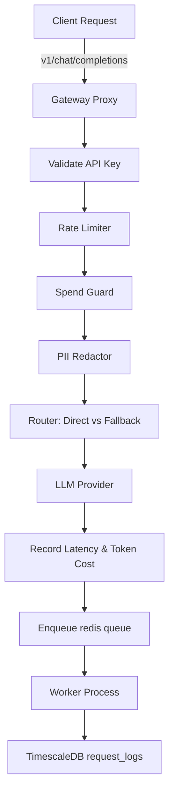

# LLM Gateway — Codebase Codex

This document serves as the developer's source of truth and architectural guide for the LLM Gateway platform. Use it to understand the system, run verification tests, or onboard future AI agents.

---

## 🗺️ Monorepo Directory Layout

The project is structured as a TypeScript monorepo using npm workspaces:

```
├── apps
│   ├── gateway-api       # Express API server (HTTP Proxy, Socket.IO real-time server)
│   ├── worker            # Background worker process handling async database log writing
│   └── frontend          # React + Vite + TypeScript glassmorphic analytics dashboard
├── packages
│   └── db                # Database schema, migrations, connection pool, seed data
└── codex.md              # [This file] Developer guide and reference context
```

---

## 🗄️ Database Architecture

The system uses **PostgreSQL** with **TimescaleDB** extensions for scalable log storage.

### Schema Blueprint
* **`teams`**: Core tenant table.
  * Columns: `id` (UUID/Text PK), `name` (Text), `fallback_config` (JSONB), `pii_redaction_enabled` (Boolean, defaults to `false`).
* **`api_keys`**: Cryptographically hashed gateway keys used to authenticate proxy requests.
  * Columns: `id` (UUID PK), `team_id` (FK), `key_hash` (Sha256 hash), `name` (Text), `is_active` (Boolean), `created_at` (Timestamp), `last_used_at` (Timestamp).
* **`team_budgets`**: Budget caps and current tracking.
  * Columns: `team_id` (PK, FK), `monthly_limit_usd` (Numeric), `current_spend_usd` (Numeric), `reset_at` (Timestamp).
* **`request_logs`**: Hypertable containing telemetry of proxy requests.
  * Columns: `time` (Timestamp, partition key), `team_id` (UUID), `api_key_id` (UUID), `provider` (Text), `model` (Text), `model_used` (Text), `was_fallback` (Boolean), `prompt_tokens` (Integer), `completion_tokens` (Integer), `cost_usd` (Numeric), `latency_ms` (Integer), `status` (Text), `pii_detected` (Boolean).

---

## ⚙️ Request Lifecycle & Core Features



### 1. Rate Limiting & Spend Guards
* **Rate Limiter**: Implemented in Redis via a sliding-window counter using the API Key hash.
* **Spend Guard**: Before forwarding requests, the gateway checks if the team's `current_spend_usd` exceeds `monthly_limit_usd`. If it does, requests are rejected with `402 Payment Required`.

### 2. PII Redaction
* When enabled (`pii_redaction_enabled = true`), input prompts undergo PII scrubbing using rules inspired by Microsoft Presidio.
* **Redaction Rules**:
  * **Emails**: RegEx matching.
  * **SSNs**: RegEx matching.
  * **Credit Cards**: RegEx matching + **Luhn Algorithm validation** to filter out invalid card numbers.
  * **IP Addresses**: Validates IPv4 octets to ensure each block is between 0 and 255.
  * **International Phone Numbers**: Matches E.164-like formatting.

### 3. Model Fallback Logic
If the primary requested model fails, the gateway inspects the team's `fallback_config` in the format:
```json
{
  "gpt-4o": ["claude-3-5-sonnet", "gemini-1.5-pro"]
}
```
It attempts each fallback model in order. If a model succeeds, the request returns successfully, and the database record logs `was_fallback = true` and `model_used = <successful_fallback_model>`.

---

## ⚡ Real-time Event System

### Redis Pub/Sub Queue
When a proxy request completes, the gateway enqueues a log write job in a Redis list (`log_jobs`) and simultaneously publishes the event to Redis Pub/Sub:
* **Channel**: `team:<team_id>`
* **Payload**: JSON log representation.

### Socket.IO Bridge
The `gateway-api` server runs a Socket.IO server.
1. Sockets authenticate on connection using the client's **Supabase JWT token**.
2. Once authenticated, the socket joins room `team:<team_id>`.
3. A Redis subscriber connection listens to `team:*` channels and publishes incoming events directly to the corresponding Socket.IO room.

---

## 📡 API Endpoints Reference

### Dashboard API (Requires Supabase JWT Auth)
* `POST /api/keys` — Generate a new API key (returns raw key once).
* `GET /api/keys` — List all keys.
* `DELETE /api/keys/:id` — Deactivate an API key.
* `GET /api/logs` — Paginated request logs with filter options.
* `GET /api/analytics/overview` — Get aggregated metrics (cost, counts, limits).
* `GET /api/analytics/timeseries` — Time-bucketed analytics for graph interfaces.
* `GET /api/teams/settings` — Read full configurations of the team.
* `PUT /api/teams/budget` — Update monthly budget limits.
* `PUT /api/teams/config` — Update team settings (pii redaction flag or fallback configs).

### Gateway API (Requires Bearer API Key Auth)
* `POST /v1/chat/completions` — Proxy endpoint for OpenAI-compatible chat requests.
* `GET /v1/protected` — Test endpoint for auth, rate limiters, and budgets.
